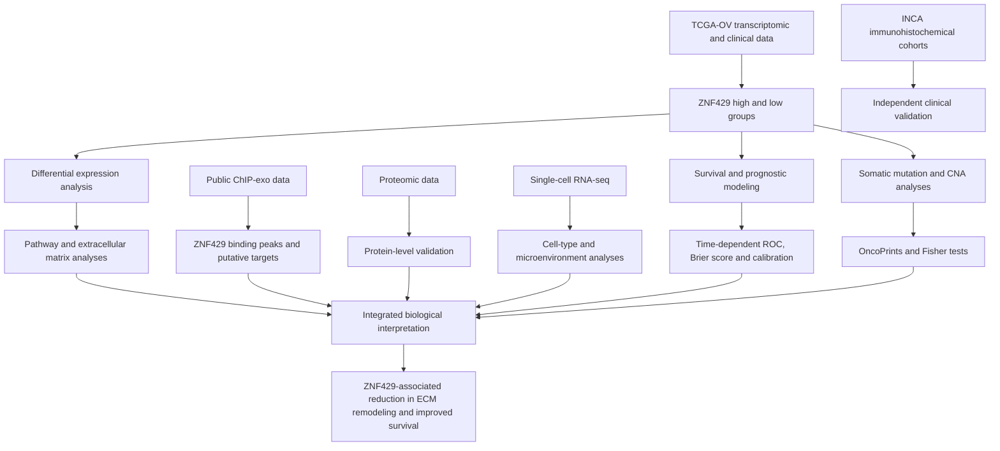

# High ZNF429 Is Associated with Reduced Extracellular Matrix Remodeling and Improved Survival in High-Grade Serous Ovarian Cancer

[](https://www.r-project.org/)
[](LICENSE)

## Repository description

This repository contains scripts and analysis-ready data objects used for the integrative genomic, transcriptomic, ChIP-exo, proteomic, single-cell, and histopathological investigation of **ZNF429** in high-grade serous ovarian cancer (HGSOC).

The repository is associated with the study:

> **High ZNF429 Is Associated with Reduced Extracellular Matrix Remodeling and Improved Survival in High-Grade Serous Ovarian Cancer**

## Background

KRAB zinc finger proteins (KRAB-ZNFs) are characterized by a Krüppel-associated box (KRAB) domain, which recruits the co-repressor TRIM28 to mediate chromatin remodeling, and zinc finger motifs that bind specific DNA sequences. Members of this family are mainly involved in the transcriptional repression of genes controlling cell differentiation, proliferation, cell-cycle progression, apoptosis, and the silencing of endogenous retroviruses and transposable elements.

Altered expression of KRAB-ZNFs has been reported in multiple tumor types and is frequently associated with patient survival and tumor histology. However, the biological and clinical roles of **ZNF429** in HGSOC remain poorly understood.

## Study overview

We integrated multiple molecular and clinical data modalities to investigate the regulatory and prognostic relevance of ZNF429 in HGSOC.

The study included:

- transcriptomic and clinical data from the TCGA-OV cohort;
- immunohistochemical and clinical data from independent INCA cohorts;
- somatic mutation and copy-number alteration data;
- publicly available ChIP-exo data;
- proteomic data;
- single-cell RNA-sequencing data;
- histopathological analyses.

The analyses focused on the relationship between ZNF429 expression, patient survival, genomic alterations, putative transcriptional targets, extracellular matrix remodeling, and the tumor microenvironment.


## Workflow



## Repository structure

```text
ZNF429-HGSOC/
├── R/
│   ├── 01_TCGA_internal_validation_TIME_ROC.R
│   ├── 02_INCA_external_validation_TIME_ROC.R
│   ├── 03_TCGA_INCA_final_panel_TIME_ROC.R
│   ├── ZNF429_multivariate_cox_TCGA_INCA.R
│   └── ZNF429_oncoprint.R
├── data/
│   ├── dados_ZNF429_TCGA_INCA.RData
│   ├── dados_ZNF429_cox.RData
│   └── dados_oncoprint_ZNF429.RData
├── LICENSE
├── README.Rmd
└── README.md
```

## Analysis scripts

### `01_TCGA_internal_validation_TIME_ROC.R`

Develops and internally validates three prognostic models in the TCGA-OV cohort:

1. clinical model: age and stage;
2. molecular model: ZNF429;
3. combined model: age, stage, and ZNF429.

The script includes:

- Cox proportional hazards models;
- Akaike information criterion;
- likelihood ratio testing;
- bootstrap-corrected C-index;
- time-dependent ROC curves;
- time-dependent Brier scores;
- Kaplan–Meier risk stratification.

### `02_INCA_external_validation_TIME_ROC.R`

Applies the TCGA-derived combined model to the independent INCA cohort and evaluates:

- time-dependent AUC at 2, 3, and 4 years;
- predicted risk scores;
- Kaplan–Meier risk stratification.

### `03_TCGA_INCA_final_panel_TIME_ROC.R`

Combines the TCGA and INCA performance results into a publication-ready multipanel figure containing:

- TCGA time-dependent ROC curves and Brier scores;
- INCA external-validation ROC curves;
- TCGA and INCA Kaplan–Meier curves;
- numbers-at-risk tables.

### `ZNF429_multivariate_cox_TCGA_INCA.R`

Fits multivariable Cox models in:

- TCGA-OV;
- the INCA adjuvant cohort;
- the INCA neoadjuvant cohort.

The models include ZNF429 group, disease stage, and age at diagnosis.

### `ZNF429_oncoprint.R`

Integrates somatic mutation and copy-number alteration data to compare ZNF429-high and ZNF429-low tumors.

The script generates:

- paired OncoPrints;
- alteration frequencies;
- analyses of HGSOC driver genes;
- analyses of genes located in the 19p12 region;
- Fisher's exact tests for copy-number alterations;
- Fisher's exact tests for point mutations.

## Data objects

### `dados_ZNF429_TCGA_INCA.RData`

Contains the TCGA and INCA data required for:

- TCGA model development;
- internal validation;
- external validation;
- the final TCGA–INCA figure panel.

### `dados_ZNF429_cox.RData`

Contains the variables required for multivariable Cox analyses in:

- TCGA-OV;
- INCA adjuvant;
- INCA neoadjuvant.

### `dados_oncoprint_ZNF429.RData`

Contains the objects required for mutation and copy-number alteration analyses, including the selected TCGA patients, ZNF429 group annotation, CNA data, and mutation data.

## Running the analyses

Clone the repository and set the repository root as the R working directory.

```bash
git clone https://github.com/bioinformatics-inca/ZNF429-HGSOC.git
cd ZNF429-HGSOC
```

The TCGA internal-validation, INCA external-validation, and final-panel scripts must be executed sequentially in the same R session:

```r
source("R/01_TCGA_internal_validation_TIME_ROC.R")
source("R/02_INCA_external_validation_TIME_ROC.R")
source("R/03_TCGA_INCA_final_panel_TIME_ROC.R")
```

The remaining analyses can be executed independently:

```r
source("R/ZNF429_multivariate_cox_TCGA_INCA.R")
source("R/ZNF429_oncoprint.R")
```

## Main R dependencies

The analyses use the following R and Bioconductor packages:

```r
install.packages(c(
  "survival",
  "survminer",
  "rms",
  "dplyr",
  "tidyr",
  "data.table",
  "timeROC",
  "ggplot2",
  "patchwork",
  "riskRegression",
  "circlize"
))

if (!requireNamespace("BiocManager", quietly = TRUE)) {
  install.packages("BiocManager")
}

BiocManager::install(c(
  "ComplexHeatmap",
  "maftools",
  "TCGAmutations"
))
```


## Data availability

The repository contains analysis-ready objects used by the available scripts. Access and reuse must comply with the applicable institutional approvals, participant-consent conditions, and data-use policies associated with the original cohorts and source datasets.

TCGA-OV data were derived from publicly available cancer genomics resources. INCA cohort data were generated under the corresponding institutional research protocols.

## Citation

A formal citation will be added after publication.

```text
Toledo N, Fonseca G, Baptista G, Esteves C, Rapozo G, Boroni M, et al.
High ZNF429 Is Associated with Reduced Extracellular Matrix Remodeling and
Improved Survival in High-Grade Serous Ovarian Cancer.
Manuscript in preparation.
```

## Contributors

The bioinformatics analyses were conducted by:

- **Nayara Toledo**
- **Gabriel Fonseca**
- **Glenerson Baptista**
- **Cristiane Esteves**
- **Gabriela Rapozo**
- **Mariana Boroni**

The study was conducted under the supervision of **Mariana Boroni**, Principal Investigator of the Bioinformatics and Computational Biology Laboratory at the Brazilian National Cancer Institute (INCA).

## License

This repository is distributed under the terms of the [MIT License](LICENSE).

## Contact

**Bioinformatics and Computational Biology Laboratory**  
Brazilian National Cancer Institute (INCA)  
GitHub organization: [bioinformatics-inca](https://github.com/bioinformatics-inca)
